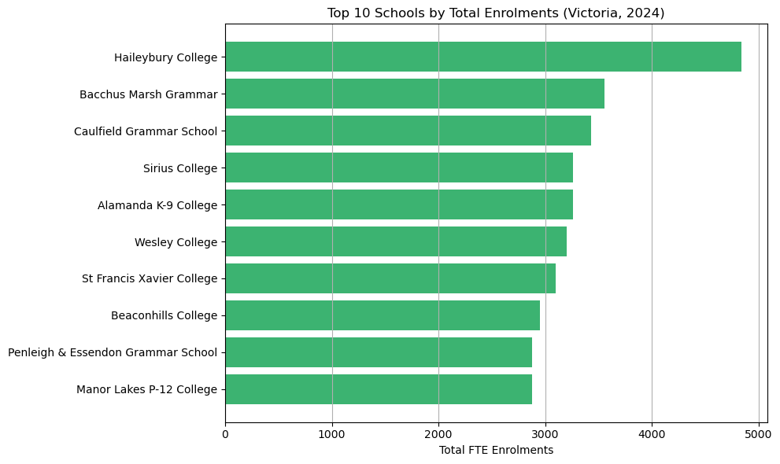

# Victoria Schools Enrolment Insights (2024)

This project analyzes school enrolment data across Victoria, Australia, collected during the February 2024 census.  
It explores total student numbers, average school sizes, top enrolling schools, and provides valuable insights that could support educational planning and student services.

## Project Structure

- **Dataset**: February 2024 census data (Government + Non-Government schools)
- **Notebook**: Data cleaning, exploratory analysis, visualization, and insights

## Key Insights

- Victoria had approximately **1,049,890** students enrolled in 2024.
- **Average school size**: 457.5 students
- **Primary schools**: 297.8 students (average)
- **Secondary schools**: 914.3 students (average)
- **Top Enrolled School**: Haileybury College (~4800 students)

## Tools Used

- Python (pandas, matplotlib)
- Jupyter Notebook
- Data Visualization

## Project Screenshots



## How to Run

1. Clone the repository
2. Open the Jupyter notebook (`victoria_enrolments_analysis.ipynb`)
3. Install libraries if missing:  
   ```bash
   pip install pandas matplotlib
